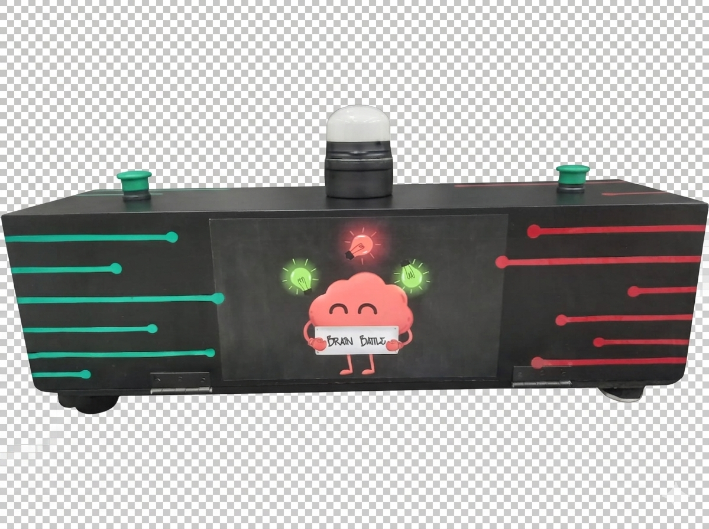
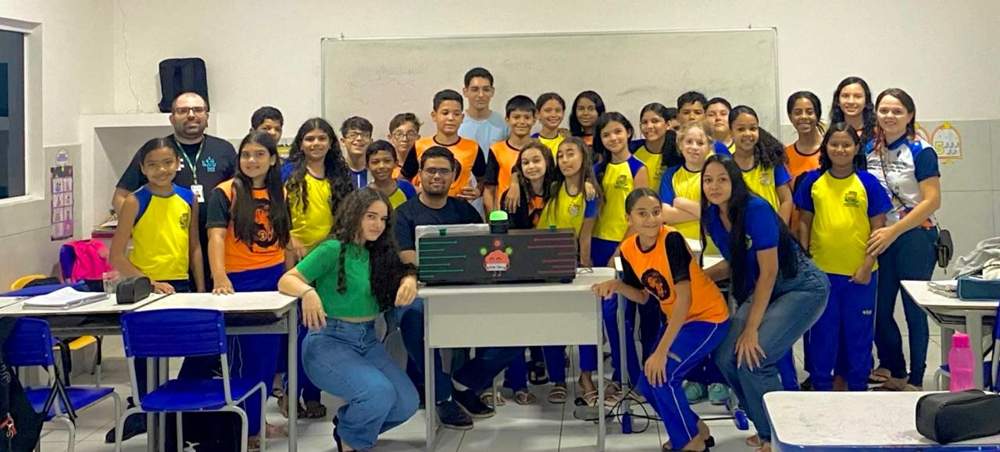
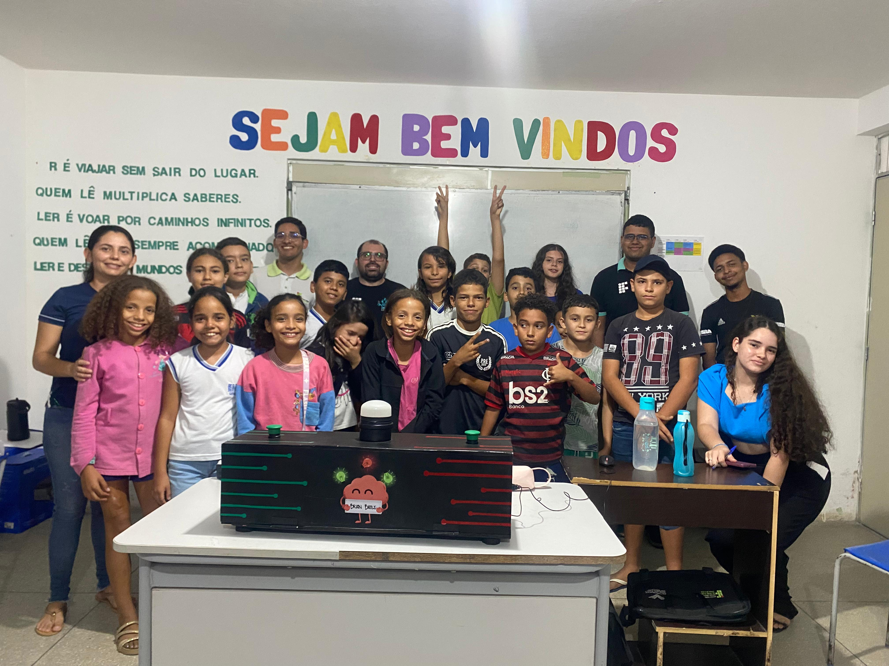
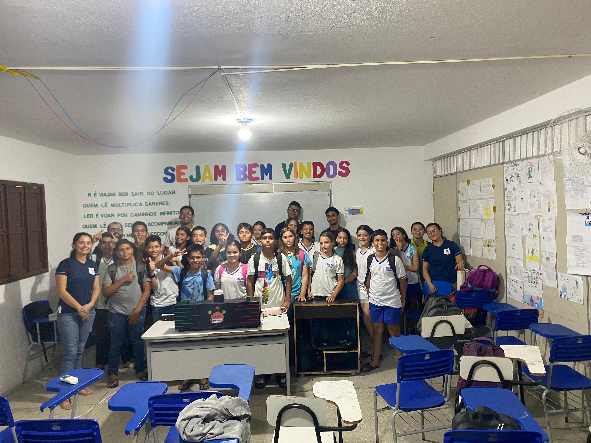
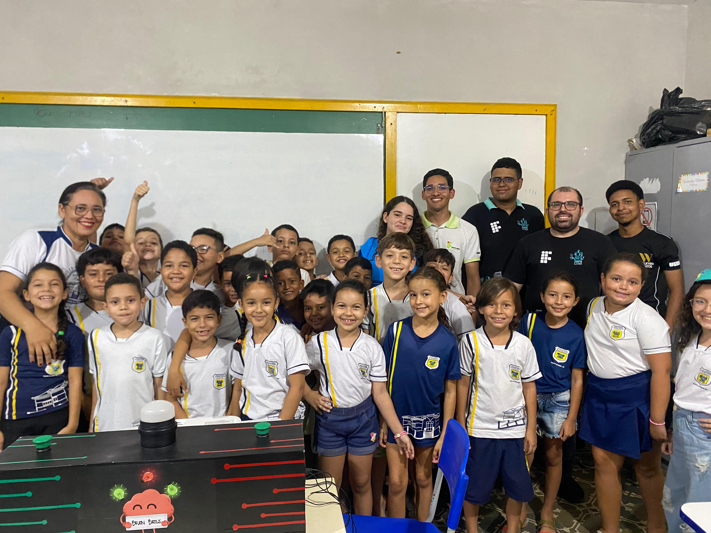
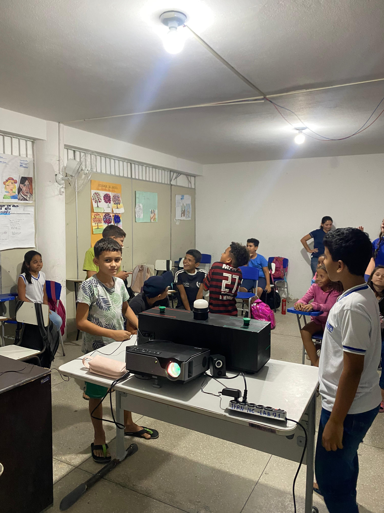
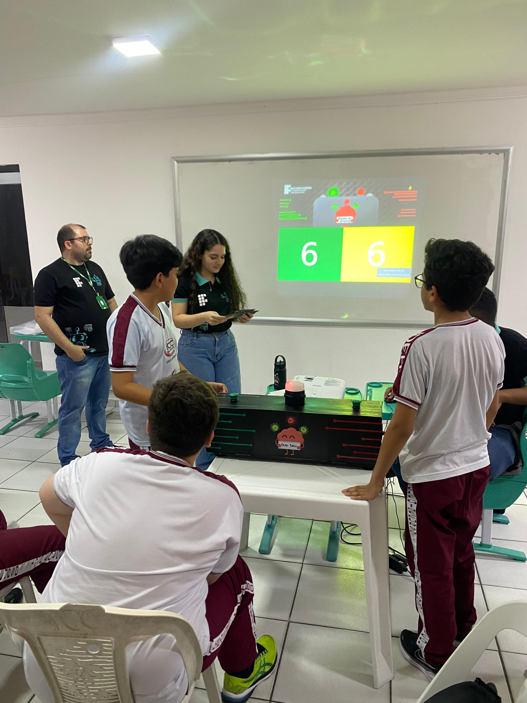
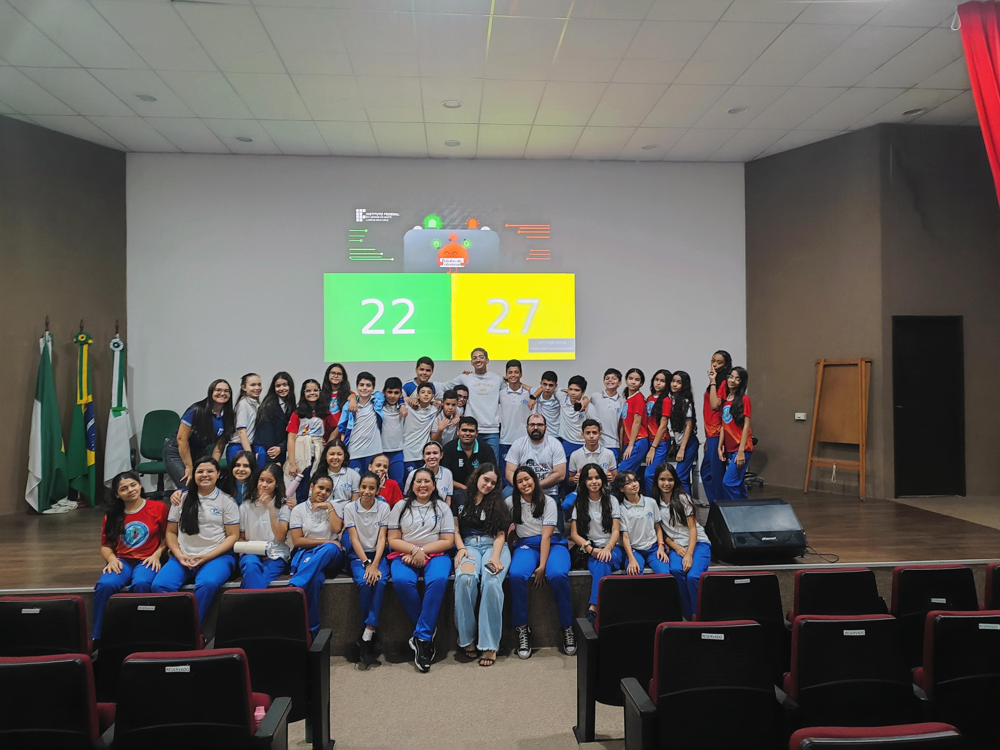
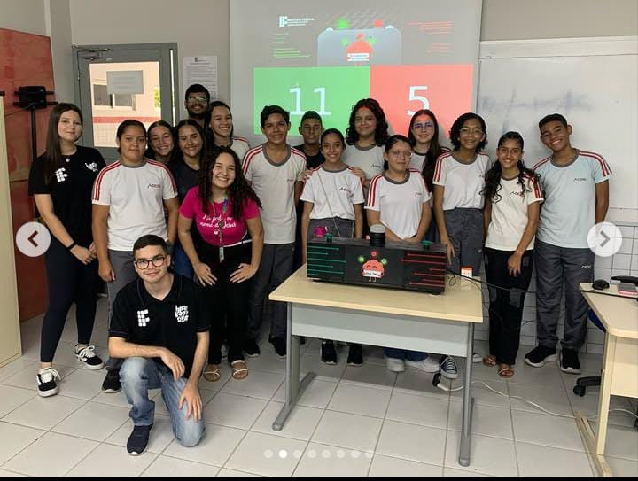
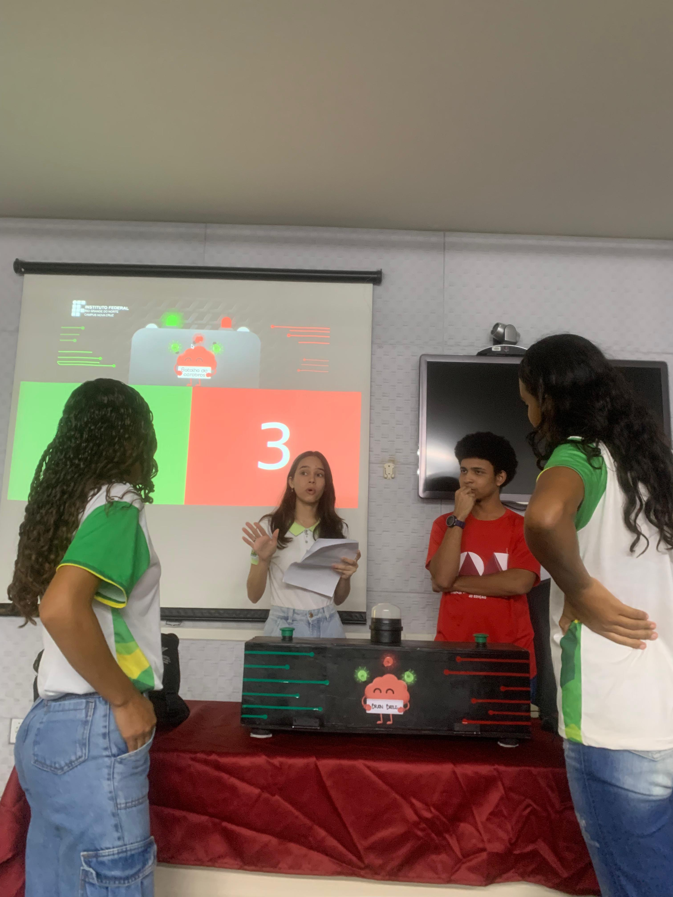

# 🕹️ BRAIN BATTLE: Perguntas e Respostas em um Projeto Extensão

  

## 🚀 Sobre o Projeto
**Identificador do Projeto:** 6868/2024

Esse projeto teve como objetivo estimular a interação dos alunos na aula por meio da gamificação, utilizando uma máquina de passa ou repassa construída pelos alunos envolvidos no projeto.

## Abaixo Imagens do projeto sendo usado em diversas escolas da região

  

  

  

  

  

  

  

  

  

